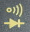

Unit 03: Continuity
===================

Theory: Continuity
------------------

While _all_ connections within a circuit have a certain amount of
resistance, the connections we use to connect components (wires or PCB
traces), which in an ideal world would have no resistance, do have
very, very low resistance, often just a small fraction of an ohm.

Thus we have the idea of "continuity" between two parts of a circuit:
any path between two points that has a very low resistance is
considered "continuous"; current will flow easily along this path
easily.

Practice: Continuity Testing with a Multimeter
----------------------------------------------

If we can't see the exact path such a connection is taking, or if we
think it may be broken in some way, we can of course measure the
resistance between two points using a multimeter. If that resistance
is very low (close to zero) we know that the two points are
electrically connected.

Most multimeters have a special mode, separate from the resistance
mode, for continuity testing. This is usually marked with a symbol
indicating propagating sound waves, often along with a diode symbol:

(If the two are together at one position on the dial, both diode and
continuity testing may be together as a single setting or you may need
to press a button to switch between the two.)

In continuity mode a meter will often display just two values
indicating whether a conductive connection between the leads exists or
not. But more importantly, all but the very cheapest meters will
generate a tone when they detect a continuous electrical path,
allowing you to concentrate on the circuit you're examining rather
than having to constantly look over at the meter.

Continuity testing is extremely useful when exploring parts and
circuits, as we are about to see.

Lab: Breadboard Wiring
----------------------

1. Figure out how to set your meter to continuity mode and touch the
   tips of the probes together. Observe how the display changes and
   whether a tone is generated.

2. Using a few of your resistors, see if you can determine the highest
   resistance value that your meter considers "continuous." What's the
   highest resistance you can find at which it still generates a tone,
   and what's the lowest resistance you can find at which it doesn't
   generate a tone? (Hint: you have sources of variable resistance;
   how could you use these to help determine the continuity break
   resistance value?)

3. Bring out the breadboard and a couple of hookup wires from your
   parts kit. Insert the hookup wires into a pair of adjacent points
   (the holes) in the breadboard and do a continuity test to determine
   whether the two points are connected. Test several more pairs of
   holes adjacent in different directions until you've found at least
   one connected and one non-connected pair.

4. Test more points and find the pattern to the layout of connected
   points on the breadboard.
